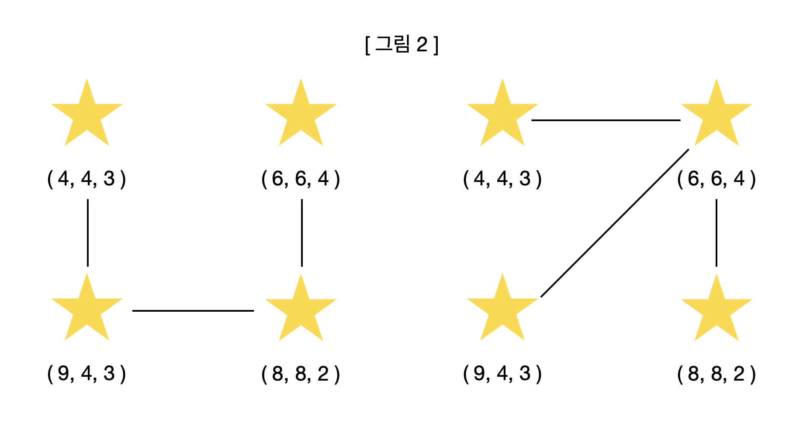

# 별 헤는 밤

 

## 🏆 알고리즘 문제 출제 대회

> SSAFY 과정 중 진행한 협업 알고리즘 문제 출제 대회 (2021.06.07 ~ 2021.06.08)
>
> 참여한 150개 팀 중 **상위 5개 팀으로 선정됨**
>
> 상위 5개 팀의 문제는 SSAFY 모든 교육생들이 SWEA 공식 홈페이지를 통해 풀이 진행

 

| 파일                                     | 비고                                       |
| ---------------------------------------- | ------------------------------------------ |
| [problem.md](./problem.md)               | '별 헤는 밤' 문제 명세                     |
| [sample_input.txt](./sample_input.txt)   | 샘플 테스트케이스용 5개 sample input       |
| [sample_output.txt](./sample_output.txt) | 샘플 테스트케이스용 5개 sample ouput       |
| [eval_input.txt](./eval_input.txt)       | 평가 테스트케이스용 50개 evaluation input  |
| [eval_output.txt](./eval_output.txt)     | 평가 테스트케이스용 50개 evaluation output |
| [solution.py](./solution.py)             | 풀이 코드                                  |

 

## 출제 의도

이 문제는 총 세 가지의 문제 해결 능력을 확인한다.

+ 주어진 별의 위치와 밝기를 이용해 이차원 배열에 별의 밝기 범위를 그려낼 수 있는가?

+ 밝기 범위가 겹치는 별들끼리 별자리를 만들 수 있는가?

+ 간선이 주어지지 않은 상황에서 가능한 모든 간선을 고려하여, 별자리 내에 있는 별들을 모두 연결하는 최소 신장 트리 알고리즘(MST)을 구현할 수 있는가?

 

​	! 모든 별들이 서로 연결되어 있지 않는 케이스를 고려해야 한다.

​	! 크기가 가장 큰 별자리가 2개 이상 존재하는 케이스를 고려해야 한다.

​	! 연결되지 않은 별들이 이후 입력되는 별에 의해 연결될 수 있음을 고려해야 한다.

 

 

## 별 헤는 밤

쉬이 잠들지 못한 새벽, 윤동주 시인은 창 앞에 고요히 앉아 밖을 바라봤다.

밤하늘을 수놓은 별들을 보며 지독한 그리움에 감싸인 윤동주 시인은 '별 헤는 밤'을 써 내려가기 시작했다.

 

 "별 하나에 추억과

   별 하나에 사랑과

   별 하나에 쓸쓸함과

   별 하나에 동경과

   별 하나에 시와 

   별 하나에 어머니, 어머니..."

 

별빛이 내린 아름다운 밤을 오래도록 바라보다 윤동주 시인은 문득 별들을 잇는 별자리를 헤아리고 싶었다.

'별자리는 어떻게 이어지는 걸까'

윤동주 시인은 별빛과 별빛이 겹치는 별들을 하나의 별자리로 세어 나갔다.

그는 눈에 들어온 별자리들의 수와 가장 많은 별로 이루어진 별자리의 크기를 알고 싶었다.

 

윤동주 시인이 '별 헤는 밤'을 완성할 수 있도록 별자리에 대한 정보를 알아내는 프로그램을 작성하라.

 

 

[예시] 

각각의 별은 자신의 위치에서 밝기에 맞는 정사각형 마름모의 형태로 빛을 내뿜는다. 밤하늘을 벗어나는 빛은 표현하지 않는다.

이때, 밝기 범위가 겹치는 별들끼리는 하나의 별자리로 본다.

또한, 아무 별과 이어지지 않은 별도 하나의 별자리로 본다.

위 그림은 행, 열, 밝기가 각각 (4, 4, 3), (6, 6, 4), (8, 2, 2)인 별들을 밤하늘에 나타낸 모습이다.

밝기가 3인 별과 밝기가 4인 별의 밝기 범위가 겹치므로 둘은 하나의 별자리를 이룬다.

밝기가 2인 별은 어떠한 별과도 밝기 범위가 겹치지 않으므로 혼자 하나의 별자리를 이룬다.

따라서, 위 그림의 경우 총 2개의 별자리가 존재한다.

 

한편, 별자리의 크기는 다음과 같은 과정을 통해 구한다.

1. 별자리를 이루고 있는 별들의 모든 쌍의 각 거리의 제곱을 구한다. 이 거리의 제곱은 편의상 별 한 쌍을 연결하는 간선의 길이로 본다.
2. 모든 별을 연결하는 간선들의 가능한 길이의 합 중 최솟값을 별자리의 크기로 한다.

위 그림은 (4, 4, 3), (6, 6, 4), (9, 4, 3), (8, 8, 2)의 정보를 갖는 별들이 한 별자리를 이루고 있을 때 가능한 간선의 유형 중 두 가지 예시다.

왼쪽 예시의 경우 간선의 길이 총합은 25 + 17 + 8 = 50이다.

오른쪽 예시의 경우 간선의 길이 총합은 13 + 8 + 8 = 29이다.

두 예시 모두 모든 별을 연결하지만, 오른쪽 예시가 간선의 길이의 합이 최소가 되는 '별자리의 크기'가 된다.

 

만약 모든 별들이 서로 연결되어 있지 않아 간선이 존재하지 않는다면 별자리의 크기는 0이 된다.

가장 많은 별로 이루어진 별자리가 두 개 이상 존재한다면, 해당 별자리들을 이루고 있는 별들 중 입력으로 가장 먼저 주어진 별이 속해있는 별자리의 크기를 구한다.

 

 

[제한 사항]

밤하늘은 한 변의 길이가 N인 정사각형이다.(5 <= N <= 20)

밤하늘의 별의 개수 M은 1 ~ 50이다.

행과 열은 각각 0 ~ N-1이다.

 

 

[입력] 

첫 번째 줄에 테스트 케이스의 수 T가 주어진다.

각 테스트 케이스의 첫 번째 줄에는 두 자연수 N, M이 주어진다.

N은 윤동주 시인이 보는 정사각형 밤하늘의 한 변의 길이, M은 별의 개수이다.

다음 M개의 줄에는 각 별의 행, 열, 밝기가 공백으로 구분되어 주어진다.

 

 

[출력]

각 테스트 케이스마다 ‘#x’(x는 테스트케이스 번호를 의미하며 1부터 시작한다), 총 별자리의 개수, 가장 많은 별로 이루어진 별자리의 크기를 공백으로 구분해 출력하라.

 

 

[입력 예]

5

5 3

0 1 2

3 2 2

4 3 3

10 5

4 4 3

6 6 4

9 4 3

8 8 2

2 8 2

10 5

0 0 2

3 3 2

6 6 2

9 9 1

7 9 1

10 8

0 1 2

1 1 4

2 3 2

4 4 3

8 2 3

5 5 2

6 6 1

9 5 2

15 20

3 0 4

4 9 2

9 9 3

7 11 3

2 15 6

6 14 1

3 0 1

2 2 4

4 2 5

7 8 5

10 1 6

15 12 2

13 1 3

7 13 3

0 15 2

14 9 6

15 9 5

7 6 3

3 11 1

7 12 5

 

 

[출력 예]

#1 2 2

#2 2 29

#3 5 0

#4 4 13

#5 5 19
